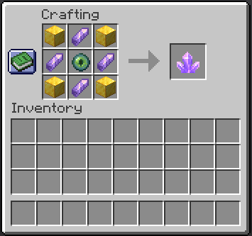
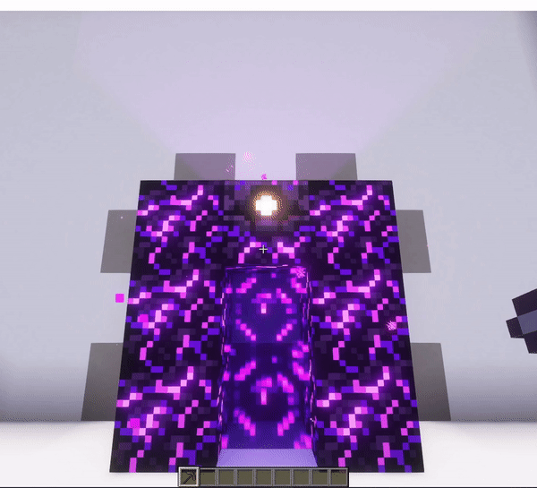

# Portal Creation

## Needed Resources

To build the portal frame and craft the key (which are essential to creating a usable portal) you will need some resources:

### Portal Frame

You need **7x** `Crying Obsidian` for one portal frame. To create a usable portal, you have to create a second portal.

That adds up to **14x** `Crying Obsidian`.

### Portal Key

PortalKey Crafting RecipeThe portal key needs to be crafted on a regular 3x3 crafting table.

The following resources are required to craft the key:

  - **4x** `Block of Gold` in the corners
  - **4x** `Amethyst Shard` between the `Blocks of Gold`
  - **1x** `Ender Eye` in the middle

See the image below as a reference.

When crafting the portal key, you’ll get two keys. These are used to create a connection between two portals and are consumed if you are initiating a portal.

## Building the Frame

The basic form of the portal is built by creating some sort of door frame out of `Crying Obsidian`. The image below visualises how you need to set up the portal frame.

The block below the portal can be any block. If you choose to change it later, you can do so without the portal breaking! Just remove the block and replace it with a block of your choice.

The blocks that make out the frame are not breakable until the portal has been [brocken](#removing-a-portal). You can, however, reuse the already used blocks to create space and resource efficient portal-rooms.

## Linking two Portals

After building the portal frame and crafting the portal key, the only thing that is left to do, is to place one portal key on the ground inside the portal frame. Now you have the first half of a functional portal. The animation blow visualises this process.

Build another portal frame and use the second key in your inventory to create a second portal. They are now automatically linked to each other and ready for action!

Step inside and check for yourself 😉

## Removing a portal

The removal of a portal is straightforward. Just break the `Respawn Anchor`. It will drop a `Crying Obsidian` and the portal key of that connection.

You can reuse the portal frame by placing the dropped `Crying Obsidian` where you broke the Respawn Anchor.

The portal key is reusable as well. Just use it on a portal frame like in the chapter above.

## Any problems along the way?

The first line of defence is your server’s support team.

If they cannot help you, they should contact us for help. We are always happy to help 👍