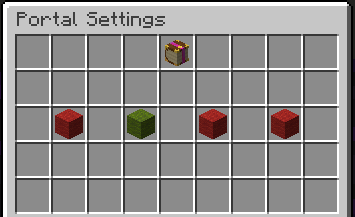

# Portal Management

When you create a portal, you are the only one that can use and modify it. This prevents other players from using up the portal's charges and reaching your portals’ destination (your super secret base, for example). But by default, everyone can charge your portal.

The image above shows the main menu with the following entries:

  - Top-Left: The information about the owner
  - Top-Middle: The current level of the portal
  - Top-Right: General information on the portal. Mainly used by Moderators for debug purposes.
  - Bottom-Middle: The Settings. Click to access the settings

## FFA (Free For All)

If you want to allow all players to use your portal, you can enable the FFA setting. This will allow everyone to use your portal without any limits. But keep an eye on the charges! Maybe have a look at the chapter [Portal Upgrading](./portal_upgrades.md)?

## Player-specific permissions

If you click the Bottom-Right head (see image in the FFA Section) you get a list of all online players. Click one of them, and they are added to your portal’s permission list with the default settings (that already apply to all others). This will take you directly to the settings for this particular player. Once added, you can access and modify the player permissions whenever you like (Even if that player is offline).

Clicking in either list on a player will take you to the player-specific permissions GUI, looking like this:

The image above shows the settings you can modify for a specific player:

  - Left: Toggle the `USE` permission
  - Middle-Left: Toggle the `CHARGE` permission
  - Middle-Right: Toggle the `UPGRADE` permission
  - Right: Toggle the `DESTROY` permission
    - This permission allows a player to take your portal key and place it somewhere else (or keep it)
