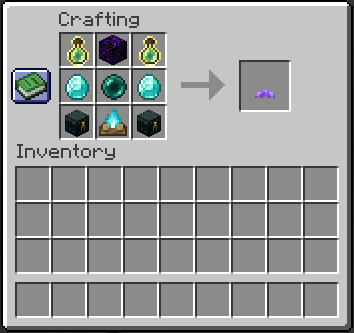
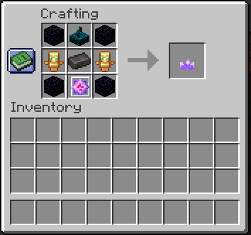
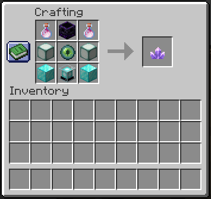

# Portal Upgrades

In general, portals should not be that resource intensive for advanced players. However, there are some aspects that can get annoying when you use the portals often. For those connections, there are some (resource intensive) upgrades to the portals you can apply to make these connections consume less `Ender Perls` to be charged. The final upgrade disables charges for the portal completely.

## How to upgrade your Portal

It’s simple. Take the Upgrade Item in your Hand and right-click the respawn anchor of the portal you want to upgrade.

## First Portal Upgrade

### Crafting

  - **2x** `Bottle o’ Enchanting` in the two upper corners
  - **1x** `Crying Obsidian` in the upper middle
  - **2x** `Diamonds` on the middle sides
  - **1x** `Ender Pearl` in the middle slot
  - **2x** `Ender Chest` in the two lower corners
  - **1x** `Soul Campfire` in the lower middle

### Effects

  - `10` charges added when charging the portal with an `Ender Pearl`

 
## Second Portal Upgrade

### Crafting

  - **4x** `Obsidian` in all four corners
  - **1x** `Sculk Sensor` in the upper middle
  - **2x** `Totems of Undying` on the middle sides
  - **1x** `Netherite Ingot` in the middle slot
  - **1x** `End Crystal` in the lower middle

### Effects

  - `20` charges (full refill) added when charging the portal with an `Ender Pearl`

 
## Third Portal Upgrade

### Crafting

  - **2x** `Dragon’s Breath` in the two upper corners
  - **1x** `Respawn Anchor` in the upper middle
  - **2x** `Sea Lanterns` on the middle sides
  - **1x** `Eye of Ender` in the middle slot
  - **2x** `Block of Diamond` in the two lower corners
  - **1x** `Beacon` in the lower middle

### Effects

  - Portal charges are no longer consumed
